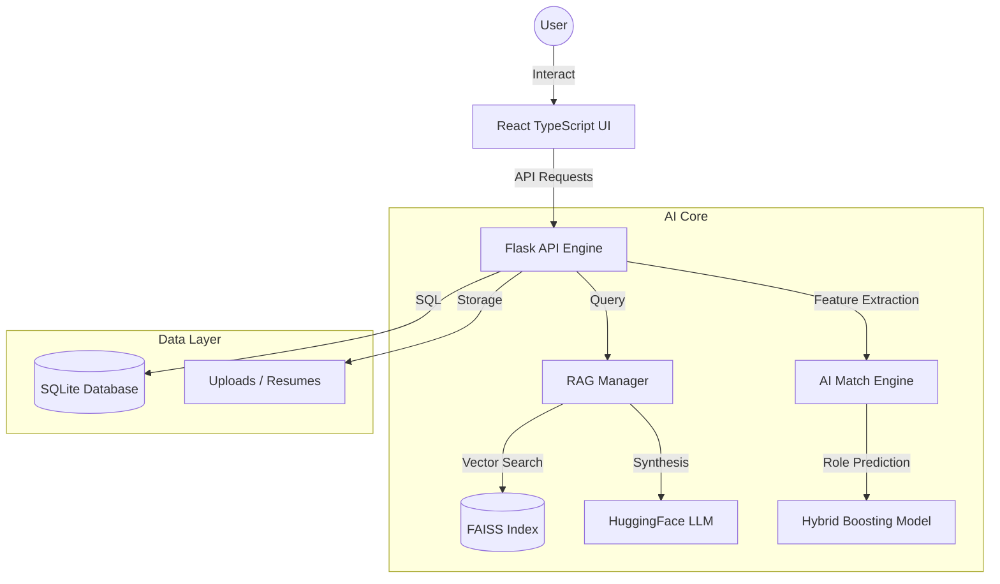

# 🚀 TalentFlow: Elite AI Hiring Intelligence System

[](https://opensource.org/licenses/MIT)
[](https://www.python.org/)
[](https://reactjs.org/)
[](https://github.com/facebookresearch/faiss)

**TalentFlow** is a production-grade Applicant Tracking System (ATS) evolved with high-performance AI reasoning. It leverages Retrieval-Augmented Generation (RAG), semantic vector search, and hybrid machine learning to transform the hiring process from manual screening to intelligent talent discovery.

---

## 🌟 Key Features

### 🧠 Semantic RAG Chatbot
- **Advanced Retrieval**: Uses FAISS for sub-millisecond semantic search across static career guides and dynamic ATS data.
- **LLM Synthesis**: Integrated with HuggingFace (Zephyr-7B) for professional, context-aware career coaching and candidate analysis.
- **Observability**: Built-in logging for latency tracking, cache hits, and source attribution.

### 📊 Recruitment Intelligence Dashboard
- **Real-time Analytics**: Visual breakdown of application statuses, average match scores, and hiring funnels.
- **Elite Match Score**: Hybrid scoring algorithm combining BERT embeddings, keyword density, role validation, and experience analysis.
- **Batch Processing**: Rapidly rank hundreds of resumes against a Job Description in seconds.

### 🛡️ Enterprise-Grade Security
- **Role-Based Access Control (RBAC)**: Strict data isolation between HR Administrators and Candidates.
- **Performance Optimized**: Local embedding caching and lazy-loading models ensure the backend stays responsive under load.

---

## 🛠️ Technology Stack

| Layer | Technologies |
| :--- | :--- |
| **Frontend** | React 18, TypeScript, Tailwind CSS, Lucide Icons, Framer Motion |
| **Backend** | Python, Flask, SQLite3 (Robust Schema) |
| **AI/ML** | Sentence-Transformers (MPNet), FAISS, HuggingFace Inference API, Scikit-Learn |
| **DevOps** | Render (Backend), Vercel (Frontend), Git |

---

## 🏗️ System Architecture



---

## 🚀 Getting Started

### Prerequisites
- Python 3.9+
- Node.js 18+
- HuggingFace API Token

### Installation

1. **Clone the repository**
   ```bash
   git clone https://github.com/HariM917/ATS.git
   cd ATS
   ```

2. **Backend Setup**
   ```bash
   cd backend
   pip install -r requirements.txt
   # Create a .env file with HF_TOKEN=your_token
   python app.py
   ```

3. **Frontend Setup**
   ```bash
   cd frontend
   npm install
   npm run dev
   ```

---

## 📜 License

Distributed under the MIT License. See `LICENSE` for more information.

---

## 🤝 Contributing

Contributions are what make the open source community such an amazing place to learn, inspire, and create. Any contributions you make are **greatly appreciated**.

1. Fork the Project
2. Create your Feature Branch (`git checkout -b feature/AmazingFeature`)
3. Commit your Changes (`git commit -m 'Add some AmazingFeature'`)
4. Push to the Branch (`git push origin feature/AmazingFeature`)
5. Open a Pull Request

---

Developed with ❤️ by [Hari](https://github.com/HariM917)
